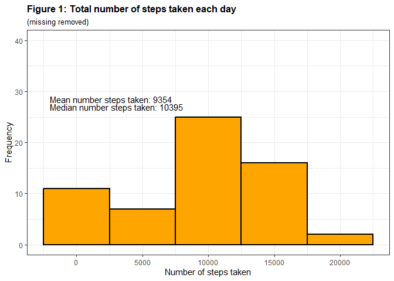
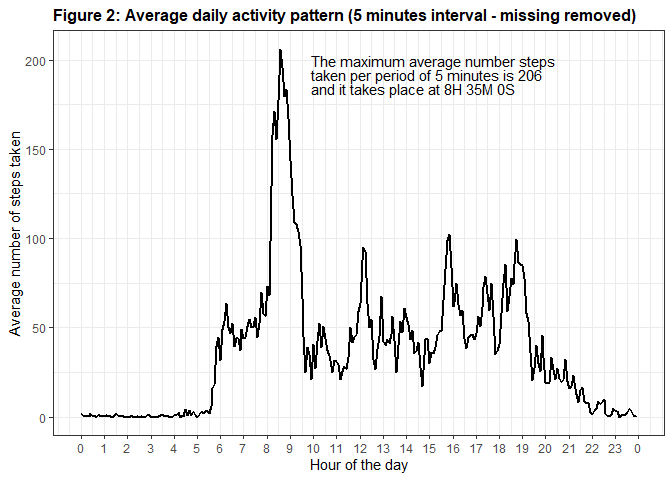
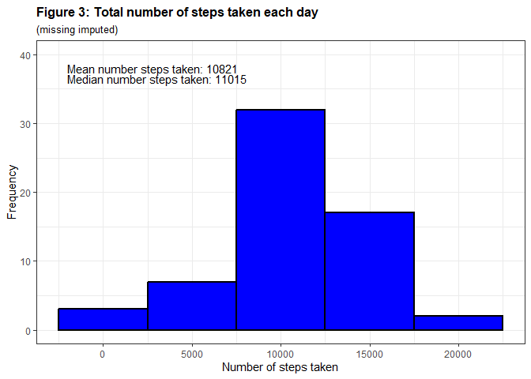
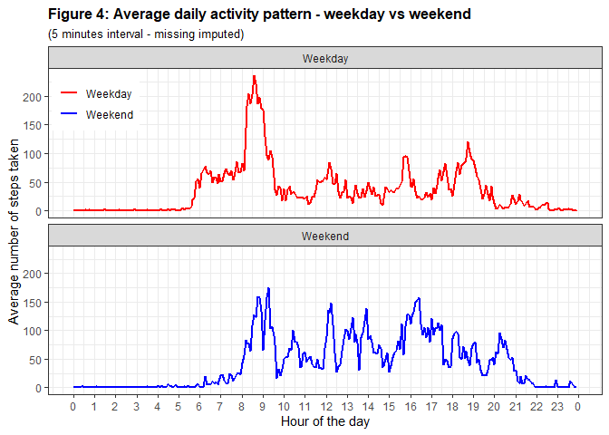

## Loading and preprocessing the data

Before loading and pre-processing the data, the global environment will
be cleaned and libraries to be used in this assessment will be loaded to
memory.

    ## Cleaning Global Environment first
    rm(list = ls())

    ## library to use
    library(dplyr)

    ## 
    ## Attachement du package : 'dplyr'

    ## Les objets suivants sont masqués depuis 'package:stats':
    ## 
    ##     filter, lag

    ## Les objets suivants sont masqués depuis 'package:base':
    ## 
    ##     intersect, setdiff, setequal, union

    library(tidyverse)

    ## ── Attaching core tidyverse packages ──────────────────────── tidyverse 2.0.0 ──
    ## ✔ forcats   1.0.0     ✔ readr     2.1.5
    ## ✔ ggplot2   3.4.4     ✔ stringr   1.5.0
    ## ✔ lubridate 1.9.3     ✔ tibble    3.2.1
    ## ✔ purrr     1.0.2     ✔ tidyr     1.3.1

    ## ── Conflicts ────────────────────────────────────────── tidyverse_conflicts() ──
    ## ✖ dplyr::filter() masks stats::filter()
    ## ✖ dplyr::lag()    masks stats::lag()
    ## ℹ Use the conflicted package (<http://conflicted.r-lib.org/>) to force all conflicts to become errors

    library(ggplot2)
    library(gridExtra)

    ## 
    ## Attachement du package : 'gridExtra'
    ## 
    ## L'objet suivant est masqué depuis 'package:dplyr':
    ## 
    ##     combine

    library(lubridate)

Once those libraries are loaded into memory, the next step of the
project is to load the data from the internet into a data frame. If
proxy server restrictions does not allow RStudio to open data from the
internet (which is the case for me due to IT protocols), download data
in a folder on computer and read from there.

    ## Setting data folder (working locally)
    ## simple paste widows copied link into r"( )"
    data.dir <- r"(F:\Jeff et Sara\Documents\R\John_Hopkins\data\)"
    data.dir <- gsub("\\\\", "/", data.dir)

    ## Set results.dir
    ## simple paste widows copied link into r"( )"
    results.dir <- r"(F:\Jeff et Sara\Documents\R\John_Hopkins\results\)"
    results.dir <- gsub("\\\\", "/", results.dir)

    ## If protocol allows...
    file <- "https://d396qusza40orc.cloudfront.net/repdata%2Fdata%2Factivity.zip"
    download.file(file,paste0(data.dir, "repdata_data_activity.zip"))
    ## In download.file(file, "repdata_data_activity.zip") : cannot open URL 'https://d396qusza40orc.cloudfront.net/repdata_data_activity.zip': HTTP status was '403 Forbidden'

    ## Loading and processing the data
    data <- read.csv(unzip(paste0(data.dir, "repdata_data_activity.zip")), header = T)

The first step is to transform the data into a usable format
(e.g. including the creation of a POSIXct variable), with the addition
of creating new variables that will be useful in future step of the
project. This includes creating a variable representing the day of the
week (will be used for imputation) as well as a dichotomous variable for
Week days/Weekend days that will also be used later. Those variable are
created upfront, but could have been created later in the analysis.

    ## Transforming date into good format using lubridate
    data$date <- ymd(data$date)

    ## create hours from intervals using floor and modify to create POSIX variables later (need to have 2 nchar)
    data$hour <- as.character(floor(data$interval/100))
    data$hour[(nchar(data$hour) == 1)] <- paste0("0", data$hour[(nchar(data$hour) == 1)])

    ## create minutes from intervals using modulo and modify to create POSIX variables later (need to have 2 nchar)
    data$minute <- as.character(data$interval %% 100)
    data$minute[(nchar(data$minute) == 1)] <- paste0("0", data$minute[(nchar(data$minute) == 1)])

    ## create hours, minutes
    data$time <- hm(paste(data$hour, data$minute, sep = ":"))

    ## create date and time variable
    data <- data %>% mutate(date.time = date + time)

    ## create day of the week and other useful variables
    data$day <- as.factor(weekdays(data$date.time))
    data$weekday <- as.factor(ifelse(weekdays(data$date.time) %in% c("samedi", "dimanche"), "Weekend", "Weekday"))
    ## if system is in English
    ## data$weekday <- as.factor(ifelse(weekdays(data$date.time) %in% c("Saturday", "Sunday"), "Weekend", "Weekday")) 
    data$hour <- as.factor(hour(data$date.time))
    data$minute <- as.factor(minute(data$date.time))

## Total number of steps (mean and median) taken per day

Before calculating the mean and the median for the total number of steps
taken per day, we need to calculate the total number of steps taken
daily. The first part of the analysis will disregard missing values.

    ## Calculate the number of steps taken per day (ignoring missing)
    total_daily_step <- data %>%  group_by(date) %>% summarize(freq = sum(steps, na.rm = T))

    ## Calculate the steps mean total number of steps taken per day (ignoring missing)
    mean_daily_step <- total_daily_step %>%  summarize(mean = mean(freq, na.rm = T))

    ## Calculate the steps median number of steps taken per day (ignoring missing)
    median_daily_step <- total_daily_step %>%  summarize(median = median(freq, na.rm = T))

Figure 1, below, is a histogram of the total number of steps taken each
day (ignoring missing).

    ## Make a histogram of the total number of steps taken each day (ignoring missing)
    g1 <- ggplot(total_daily_step, aes(x=freq)) + geom_histogram(fill = "orange", color = "black", linewidth = 1, binwidth = 5000)
    g1 <- g1 + labs(title = "Figure 1: Total number of steps taken each day", subtitle = "(missing removed)", x = "Number of steps taken", y= "Frequency") + theme_bw()
    g1 <- g1 + ylim(0,40) + theme(plot.title = element_text(size = 12, face = "bold"))
    g1 <- g1 + geom_text(data = mean_daily_step, mapping = aes(x=-2000, y=28.5, hjust = 0, label = c(paste0("Mean number steps taken: ",round(mean))))) 
    g1 <- g1 + geom_text(data = median_daily_step, mapping = aes(x=-2000, y=27, hjust = 0, label = c(paste0("Median number steps taken: ",round(median))))) 
    g1 <- g1 + ylim(0,40) + theme(plot.title = element_text(size = 12, face = "bold"), plot.subtitle = element_text(size = 10))

    ## Scale for y is already present.
    ## Adding another scale for y, which will replace the existing scale.

    g1

    ggsave(file = paste0(results.dir, "Figure1.png"),g1)

    ## Saving 7 x 5 in image

As indicated on Figure 1, the mean number of steps taken per day over
the period analysed is 9 354 while the median number of steps taken is
10 395.

## Mean number of steps taken per 5 minutes intervals (ignoring missing)

We will now calculate the mean number of steps taken per 5 minutes
intervals, once again ignoring missing. In order to make it easier to
plot the time period, we will create a variable that follow the grouping
position (i.e.: hour and minute) to make it easier to plot results
nicely over the time period. We also identify which daily 5-minute
interval contain, on average, the maximum number of steps taken.

    mean_interval_step <- data %>%  group_by(time) %>% summarize(mean = mean(steps, na.rm = T))
    mean_interval_step$count <- 1:nrow(mean_interval_step)
    mean_interval_step$hour <- hour(as.POSIXct(as.Date("2012-10-01") + mean_interval_step$time))
    mean_interval_step$minute <- minute(as.POSIXct(as.Date("2012-10-01") + mean_interval_step$time))
    hours_labels <- c(as.character(unique(mean_interval_step$hour)), "0")
    hours_breaks <- seq(1, 289, by = 12)

    ## Identify which 5-minute interval, on average across all the days in the dataset, contains the maximum number of steps?
    max_interval_step <- mean_interval_step %>% filter(mean == max(mean))

Figure 2, below, is a line graph of the mean number of steps taken per 5
minutes intervals (ignoring missing).

    g2 <- ggplot(mean_interval_step, aes(x = count  , y = mean)) + geom_line(color = "black", lwd = 1) + scale_x_continuous(breaks = hours_breaks, labels=hours_labels)
    g2 <- g2 + labs(title = "Figure 2: Average daily activity pattern (5 minutes interval - missing removed)", x = "Hour of the day", y= "Average number of steps taken") + theme_bw()
    g2 <- g2 + theme(plot.title = element_text(size = 12, face = "bold")) 
    g2 <- g2 + annotate("text", x=120, y=200, hjust = 0, label = c(paste0("The maximum average number steps")))
    g2 <- g2 + annotate("text", x=120, y=192, hjust = 0, label = c(paste0("taken per period of 5 minutes is ",round(max_interval_step$mean)))) 
    g2 <- g2 + annotate("text", x=120, y=184, hjust = 0, label = c(paste0("and it takes place at ",max_interval_step$time))) 
    g2 

    ggsave(file = paste0(results.dir, "Figure2.png"),g2)

    ## Saving 7 x 5 in image

As indicated on Figure 2, the maximum average number steps taken per
period of 5 minutes is 206 and it takes place at 8H 35M 0S.

## Impact of missing values (and imputation of those)

The first step taken here is to calculate and report the total number of
missing values in the data. We have a more detailled look at the
observation to ensure which variable(s) has missings.

    sum(is.na(data))

    ## [1] 2304

    sapply(data, function(x) sum(is.na(x)))

    ##     steps      date  interval      hour    minute      time date.time       day 
    ##      2304         0         0         0         0         0         0         0 
    ##   weekday 
    ##         0

In order to impute missing, we will look at daily patterns (e.g.: days
of the week) by hours and 5 minutes intervals using the variables
created earlier. We will then create a new data set where we will
replace missing observations by calculated means. Before moving forward,
we ensure we don’t have anymore missing observations.

    ## Calculate the steps mean by day and interval (ignoring missing)
    mean_detailled_step <- data %>%  group_by(day, hour, minute) %>% summarize(mean = mean(steps, na.rm = T))

    ## `summarise()` has grouped output by 'day', 'hour'. You can override using the
    ## `.groups` argument.

    ## Create a new dataset that is equal to the original dataset but with the missing data filled in.
    new_data <- merge(data, mean_detailled_step, by = c("day", "hour", "minute"))

    ## Replacing Steps if missing
    new_data$steps[is.na(new_data$steps)] <- new_data$mean[is.na(new_data$steps)] 

    ## verifying if there are remain missing
    sapply(new_data, function(x) sum(is.na(x)))

    ##       day      hour    minute     steps      date  interval      time date.time 
    ##         0         0         0         0         0         0         0         0 
    ##   weekday      mean 
    ##         0         0

Once this is done, we used the same approach as before to calculate the
mean and the median for the total number of steps taken per day, but
this time with imputed values replacing missing ones.

    ## Calculate the number of steps taken per day with missing imputed
    total_daily_step_imputed <- new_data %>%  group_by(date) %>% summarize(freq = sum(steps))

    ## Calculate the steps mean total number of steps taken per day with missing imputed
    mean_daily_step_imputed <- total_daily_step_imputed %>%  summarize(mean = mean(freq, na.rm = T))

    ## Calculate the steps median number of steps taken per day with missing imputed
    median_daily_step_imputed <- total_daily_step_imputed %>%  summarize(median = median(freq, na.rm = T))

Figure 3, below, is a histogram of the total number of steps taken each
day with missing replaced by imputed values.

    g3 <- ggplot(total_daily_step_imputed, aes(x=freq)) + geom_histogram(fill = "blue", color = "black", linewidth = 1, binwidth = 5000)
    g3 <- g3 + labs(title = "Figure 3: Total number of steps taken each day", subtitle = "(missing imputed)", x = "Number of steps taken", y= "Frequency") + theme_bw()
    g3 <- g3 + geom_text(data = mean_daily_step_imputed, mapping = aes(x=-2000, y=38, hjust = 0, label = c(paste0("Mean number steps taken: ",round(mean))))) 
    g3 <- g3 + geom_text(data = median_daily_step_imputed, mapping = aes(x=-2000, y=36.5, hjust = 0, label = c(paste0("Median number steps taken: ",round(median))))) 
    g3 <- g3 + ylim(0,40) + theme(plot.title = element_text(size = 12, face = "bold"), plot.subtitle = element_text(size = 10))
    g3

    ggsave(file = paste0(results.dir, "Figure3.png"),g3)

    ## Saving 7 x 5 in image

As indicated on Figure 3, the mean number of steps taken per day over
the period analysed is 10 821 while the median number of steps taken is
11 015.

As we can see, not only does the shape of Figure 3 changes compare to
figure 1, but the mean number of steps taken per day over the period
analysed increase by 1 467 while the median increase by 620.

## Differences in activity patterns between weekdays and weekends

The last step of this project is to assess if there are differences in
activity patterns between weekdays and weekends (using the data with the
filled-in missing values). First, let’s group the data using the weekday
variable prepared in the first steps of this project. The next step is
do do similar calculations as done for Figure 2.

    mean_interval_step_imputed <- new_data %>%  group_by(weekday, time) %>% summarize(mean = mean(steps, na.rm = T))

    ## `summarise()` has grouped output by 'weekday'. You can override using the
    ## `.groups` argument.

    ## Create a variable that follow group(hour, minute)position to make it easier to plot time period 
    mean_interval_step_imputed <- mean_interval_step_imputed %>% group_by(weekday) %>% mutate(count = seq(n()))

    mean_interval_step_imputed$hour <- hour(as.POSIXct(as.Date("2012-10-01") + mean_interval_step_imputed$time))
    mean_interval_step_imputed$minute <- minute(as.POSIXct(as.Date("2012-10-01") + mean_interval_step_imputed$time))

    ## Which 5-minute interval, on average across all the days in the dataset, contains the maximum number of steps?
    max_interval_step_imputed <- mean_interval_step_imputed %>% group_by(weekday) %>% filter(mean == max(mean))

Figure 4, below, is a line graph of with the mean number of steps taken
per 5 minutes intervals (with missing replaced by imputed values) for
week days and weekend days.

    g4 <- ggplot(mean_interval_step_imputed, aes(x = count  , y = mean, color = weekday)) + geom_line(lwd = 1) + scale_x_continuous(breaks = hours_breaks, labels=hours_labels)
    g4 <- g4 + scale_color_manual(values=c("red","blue")) + facet_wrap(~weekday, ncol = 1, nrow=2)
    g4 <- g4 + labs(title = "Figure 4: Average daily activity pattern - weekday vs weekend", subtitle = "(5 minutes interval - missing imputed)", x = "Hour of the day", y= "Average number of steps taken") + theme_bw()
    g4 <- g4 + theme(plot.title = element_text(size = 12, face = "bold"), plot.subtitle = element_text(size = 10), legend.title=element_blank(), legend.justification=c(0.9,0.9), legend.position=c(0.15,0.98)) 
    g4 

    ggsave(file = paste0(results.dir, "Figure4.png"),g4)

    ## Saving 7 x 5 in image

As we clearly see from figure 4, the daily patterns appears to be
different for week days and weekend days. The maximum average number
steps taken per period of 5 minutes, during week days, is 237 and it
takes place at 8H 35M 0S. This compares respectively to 175 steps taking
place at 9H 15M 0S for weekend days.
